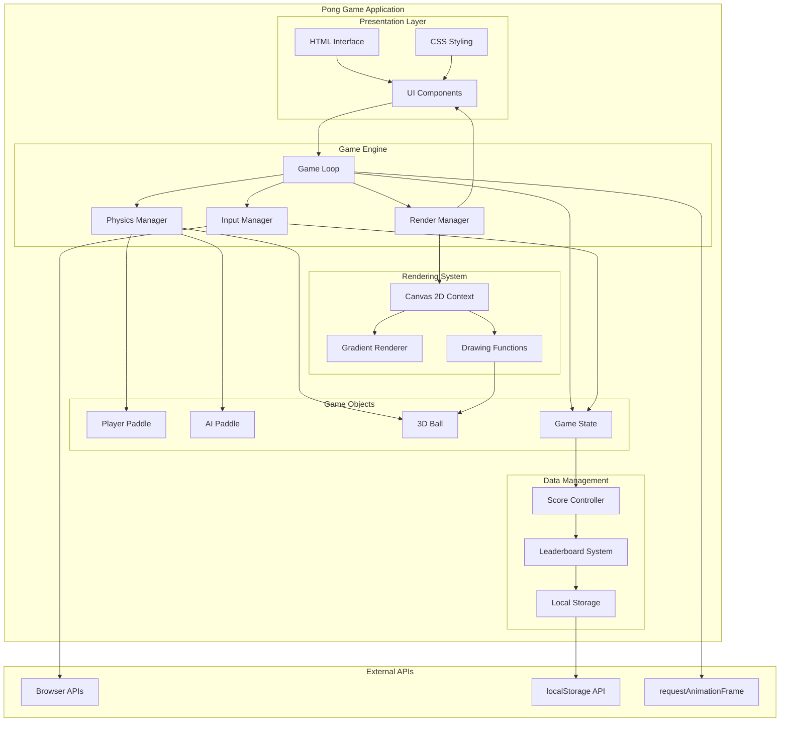
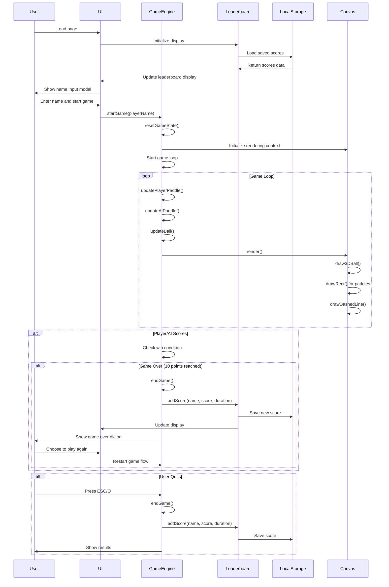
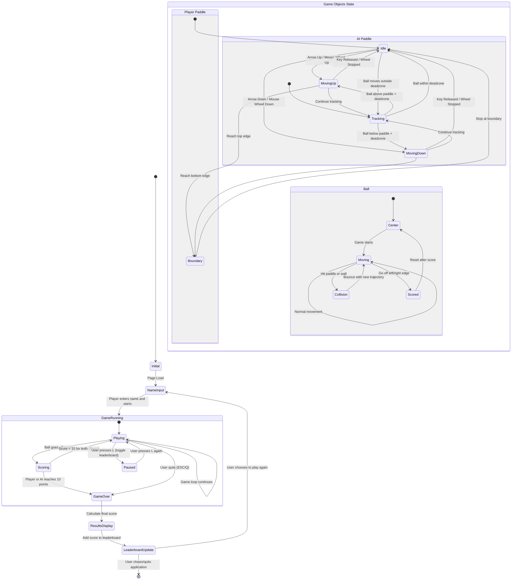
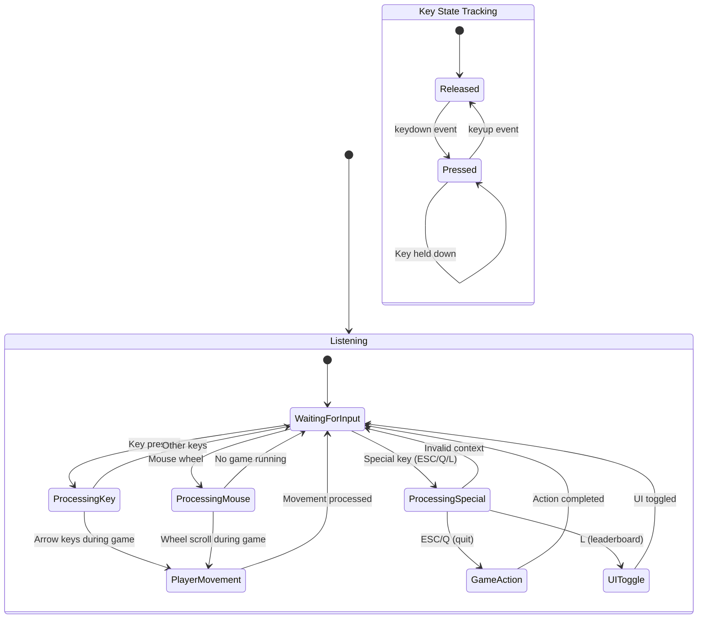
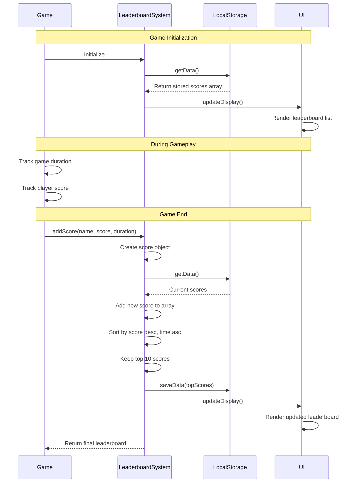
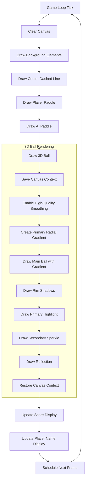
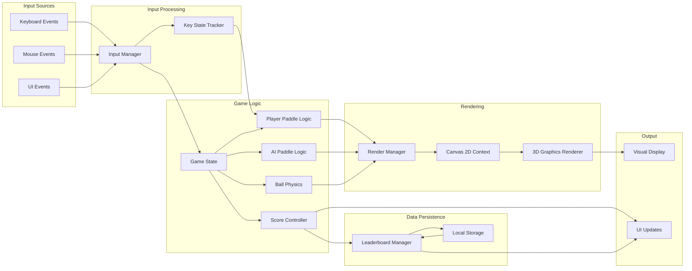
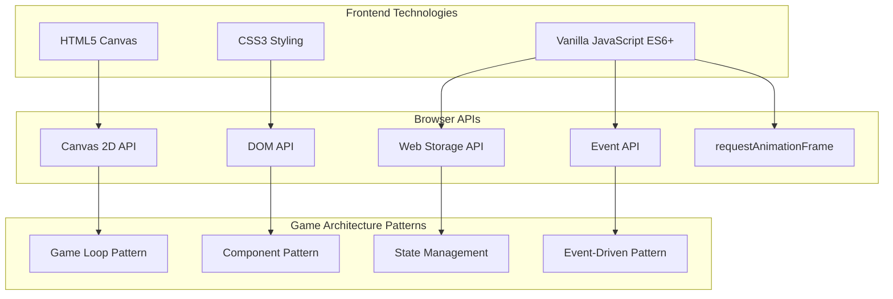

# Pong Game Architecture Documentation

This document provides comprehensive architecture diagrams for the enhanced Pong game implementation.

## Component Diagram

## Game Flow Sequence Diagram

## Game State Diagram

## Input Handling State Diagram

## Leaderboard System Sequence Diagram

## Rendering Pipeline Diagram

## Data Flow Diagram

## Technology Stack Overview

---

## Architecture Notes

### Key Design Decisions

1. **Vanilla JavaScript**: No frameworks to maintain simplicity and performance
2. **Component-based Architecture**: Separated concerns for rendering, physics, input, and data
3. **Canvas 2D Rendering**: Chosen for 2D game graphics with 3D visual effects
4. **Local Storage**: Persistent leaderboard without requiring server infrastructure
5. **Game Loop Pattern**: Standard pattern for real-time game updates
6. **Event-driven Input**: Responsive controls using browser event system

### Performance Considerations

- Uses `requestAnimationFrame` for smooth 60fps rendering
- Efficient collision detection with bounding box calculations
- Gradient caching within render functions
- Minimal DOM manipulation during gameplay

### Extensibility

The modular architecture allows for easy extension:
- New game modes can be added by extending the game state
- Additional rendering effects can be integrated into the graphics pipeline
- Different AI algorithms can replace the current tracking system
- Multiplayer support could be added through the input management system